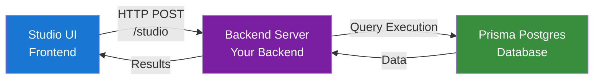

# Prisma Studio Playground - PPG Integration

A simple and elegant example of how to integrate Prisma Studio with your backend using Prisma Postgres (PPG). This playground demonstrates the complete flow from frontend to backend, showing how Studio communicates with your server to execute database queries.

## 🎯 What This Does

This playground shows you how to:
- Set up a backend endpoint that handles Prisma Studio queries
- Connect Studio to your backend with custom headers and payloads
- Execute queries against Prisma Postgres using the Accelerate client
- Handle errors gracefully and return results to the Studio UI

## 🏗️ Architecture Overview



## TL;DR;
There are only two relevant files to see, the rest is just boilerplate
- Open the `frontend/index.tsx` file to see how to set up the Studio component.
- Open the `server/index.ts` file to see how to handle Studio queries in your backend.
- Get your Prisma Postgres URL from the [Prisma Console](https://console.prisma.io/) and set it in the `.env` file.
- Run the playground with `npm run dev` and open Studio the URL from the console output.

## 🚀 Frontend Setup

The frontend creates a Studio component that connects to your backend:

```tsx
// frontend/index.tsx
import { Studio } from "@prisma/studio-core/ui";
import { createPostgresAdapter } from "@prisma/studio-core/data/postgres-core";
import { createStudioBFFClient } from "@prisma/studio-core/data/bff";

function App() {
  const adapter = useMemo(() => {
    // 1. Create a client that points to your backend endpoint
    const executor = createStudioBFFClient({
      url: "http://localhost:4242/studio",
      customHeaders: {
        "X-Custom-Header": "example-value", // Pass any custom headers
      },
      customPayload: {
        customValue: "example-value" // Pass any custom data
      }
    });

    // 2. Create a Postgres adapter with the executor
    const adapter = createPostgresAdapter({ executor });
    return adapter;
  }, []);

  return (
    <Layout>
      <Studio adapter={adapter} />
    </Layout>
  );
}
```

### Key Frontend Concepts:

- **Executor**: The bridge between Studio and your backend
- **Adapter**: Handles Postgres-specific query formatting
- **Custom Headers**: Pass authentication tokens, user info, etc.
- **Custom Payload**: Send additional context with each request

## 🔧 Backend Setup

The backend receives Studio queries and executes them against your database:

```typescript
// server/index.ts
import { Hono } from "hono";
import { createPrismaPostgresHttpClient } from "@prisma/studio-core/data/ppg";
import { serializeError } from "@prisma/studio-core/data/bff";

const app = new Hono().use("*", cors());

app.post("/studio", async (c) => {
  // 1. Extract the query and custom data from the request
  const { query, customPayload } = await c.req.json();
  
  // 2. Access custom headers (great for auth!)
  const customHeader = c.req.header("X-Custom-Header");
  console.log("Received headers:", { customHeader });
  
  // 3. Use custom payload data
  console.log("Received value:", customPayload.customValue);
  
  // 4. Determine the URL (this is where you'd implement your auth logic)
  const url = determineUrlFromContext(customHeader, customPayload);
  
  // 5. Execute the query using Prisma Postgres or Prisma Accelerate
  const [error, results] = await createPrismaPostgresHttpClient({ url }).execute(query);
  
  // 6. Return results or errors
  if (error) {
    return c.json([serializeError(error)]);
  }
  
  return c.json([null, results]);
});
```

### Key Backend Concepts:

- **Query Object**: Contains the SQL query and parameters from Studio
- **Custom Payload**: Additional data sent with each request
- **Accelerate Client**: Executes queries against your database
- **Error Handling**: Properly serialize errors for Studio to display

## 🔄 The Complete Flow

1. **User Interaction**: User clicks on a table in Studio UI
2. **Query Generation**: Studio generates a SQL query to fetch data
3. **Request Preparation**: Frontend packages the query with custom headers/payload
4. **HTTP Request**: POST request sent to `/studio` endpoint
5. **Authentication**: Backend extracts custom data to determine the db URL
6. **Query Execution**: Backend uses Accelerate client to execute query
7. **Response**: Results or errors are sent back to Studio
8. **UI Update**: Studio displays the data or error message

## 🎨 Customization Examples

### Adding User Authentication

```typescript
// Backend - Extract user info from headers
const userId = c.req.header("X-User-ID");
const token = c.req.header("Authorization");

// Validate and get user's database credentials
const userUrl = await getUserUrl(userId, token);
```

```tsx
// Frontend - Pass user info
const executor = createStudioBFFClient({
  url: "http://localhost:4242/studio",
  customHeaders: {
    "X-User-ID": currentUser.id,
    "Authorization": `Bearer ${userToken}`,
  },
});
```

## 🚦 Running the Playground

### 1. Environment Setup

First, copy the example environment file and add your Prisma Postgres URL:

```bash
cp .env.example .env
```

Then edit `.env` and replace `your_prisma_postgres_url_here` with your actual URL from [Prisma Console](https://console.prisma.io/).

### 2. Start the Development Server

```bash
npm run dev
# Server runs on http://localhost:4242
# Frontend runs on http://localhost:3000
```

**Open Studio**: Navigate to `http://localhost:3000` and explore your database!

